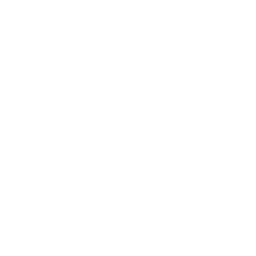
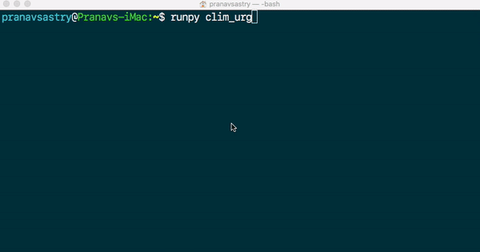
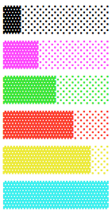

# progress-bar

<p float=left>
  
  
</p>

# Download progbar<br>
<a href="https://raw.githubusercontent.com/pranavsastry/progress-bar/main/progbar.py">**Download**</a><br>

# Demo<br>
<br/>

# Supported Colors<br>
{"red", "cyan", "yellow", "green", "purple"}<br>
<br/>

# Running the Demo<br>
**1. Download progbar.py and make sure your working directory and the path in which progbar.py is downloaded, matches <br>
2. Download demo.py into the same directory <br>
3. Run demo.py <br>**

# Code Snippets <br>
```
>>> from progbar import ProgressBar
>>> bar = ProgressBar(15)
>>> print(bar.bar)
░░░░░░░░░░░░░░░
>>> bar.update_till(5)
>>> print(bar.bar)
▓▓▓▓▓░░░░░░░░░░
>>> bar.update()
>>> print(bar.bar)
▓▓▓▓▓▓░░░░░░░░░
>>> bar.reset()
>>> print(bar.bar)
░░░░░░░░░░░░░░░
>>> 
```
